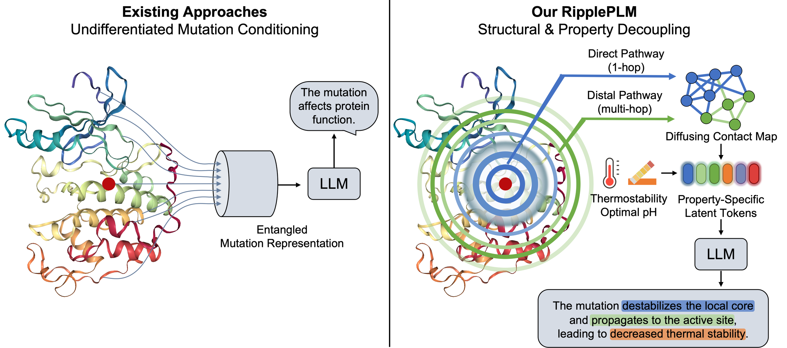
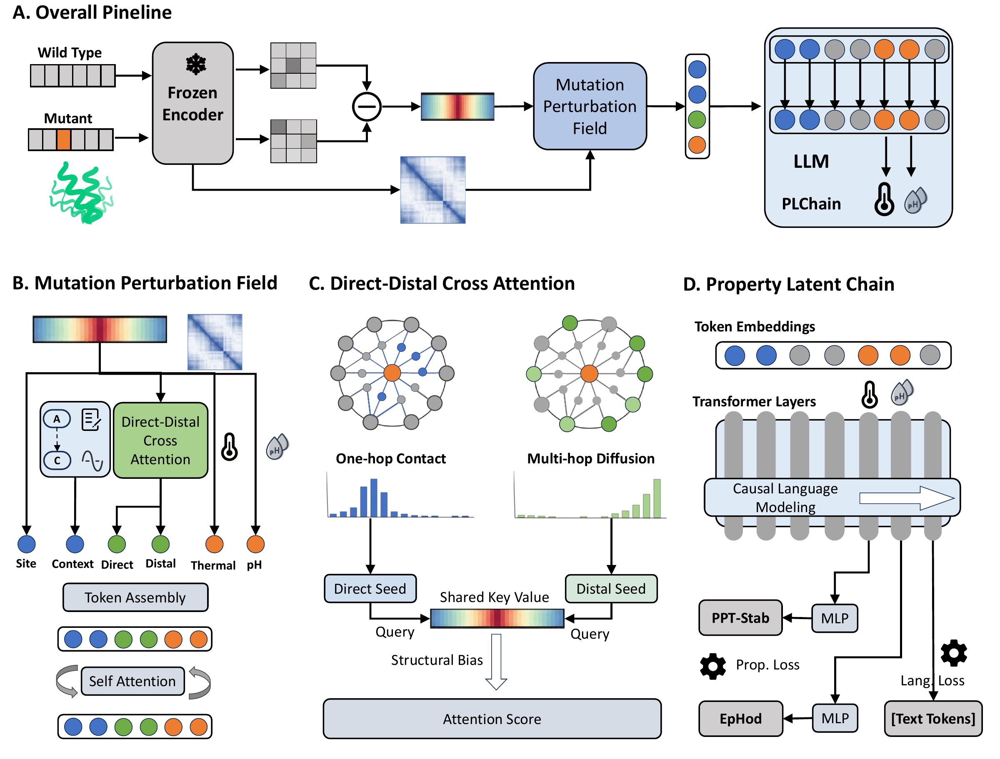
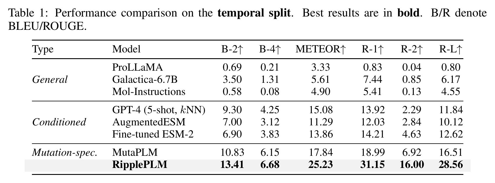
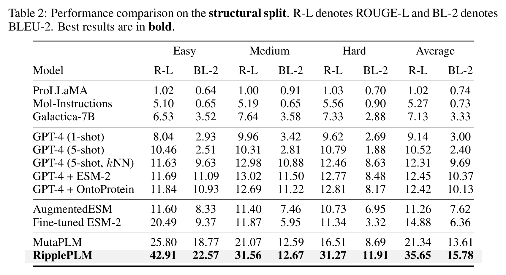

# RipplePLM

Official code for [NeurIPS 2026] RipplePLM: Structural and Property Decoupling for Protein Mutation Effect Generation.

## Overview

RipplePLM is a mutation-specific LLM built on DeepSeek-R1-Distill-Llama-8B that generates natural-language descriptions of protein mutation effects. Its design follows a biologically motivated progression:

> **Sequence variation → Structural perturbation → Global property changes → Functional effects and their descriptions**

An amino acid substitution can alter its local structural environment and propagate through distal contacts, affecting global biochemical properties. These changes help shape the mutation's functional consequences.

**RipplePLM models this progression, using it as an inductive bias for mutation-effect generation.** Its representations connect sequence-level perturbations, direct and distal structural evidence, and property-aware latent states to guide functional description generation.



- **Sequence → perturbation field:** MPF (Mutation Perturbation Field) captures residue-level differences between frozen ESM-2 representations of wild-type and mutant proteins.
- **Perturbation field → structural context:** DDCA (Direct-Distal Cross-Attention) uses predicted contacts to organize mutation evidence into immediate contact neighborhoods and distal, multi-hop pathways.
- **Structural context → property-aware generation:** PLChain (Property Latent Chain) applies expert supervision for thermostability and optimal pH changes to latent property tokens. Together with the structural tokens, they condition the LLM's functional descriptions.



## Main results

Results on **MutaDescribe**, as reported in the paper. Scores are on a 0–100 scale; higher is better.

<p align="center">
  
</p>

<p align="center">
  
</p>

## Setup

The training scripts use 8 NVIDIA A800 GPUs with Linux and Python 3.10.

```bash
pip install -r requirements.txt
python -m nltk.downloader wordnet omw-1.4
```

Download [DeepSeek-R1-Distill-Llama-8B](https://huggingface.co/deepseek-ai/DeepSeek-R1-Distill-Llama-8B) into `./DeepSeek-R1-Distill-Llama-8B`, then download ESM weights:

```bash
curl -fLO https://dl.fbaipublicfiles.com/fair-esm/models/esm2_t30_150M_UR50D.pt
curl -fLO https://dl.fbaipublicfiles.com/fair-esm/regression/esm2_t30_150M_UR50D-contact-regression.pt
```

## Data

Download [RipplePLM-data](https://huggingface.co/datasets/GreatCaptainNemo/RipplePLM-data) into `data/`:

```bash
python tools/download_data.py
```

Both `structural_split/` and `temporal_split/` contain `train_with_label.csv`, `val_with_label.csv`, and `test_with_label.csv`.

| Column | Description |
| --- | --- |
| `entry` | Protein ID and mutation, e.g. `P12345-A123B`; residue positions are 1-based. |
| `protein1` | Wild-type amino acid sequence. |
| `protein2` | Mutant sequence; reconstructed from `entry` if absent. |
| `function` | Wild-type protein function used as input context. |
| `uniprot_description` | UniProt mutation-effect description. |
| `GPT_description` | Additional generated mutation-effect description. |
| `all_description` | Description field used to filter samples with missing annotations. |
| `ephod_label` | Integer class label for pH. |
| `pptstab_label` | Integer class label for thermostability. |

The reference text combines `uniprot_description` and `GPT_description`. Samples missing `function` or `all_description` are omitted.

## Training

Run from the repository root. Set `SPLIT` to `structural` or `temporal`:

```bash
export SPLIT=structural
bash scripts/train-s1-dsllama.sh
bash scripts/train-s2-dsllama.sh
```

| Stage | Epochs (structural / temporal) | Batch / GPU | Accumulation | Learning rate | LoRA rank |
| --- | ---: | ---: | ---: | --- | ---: |
| 1: MPF training | 1 / 1 | 6 | 1 | 2e-4 | 1, frozen |
| 2: Joint training | 2 / 10 | 4 | 2 | 5e-5 | 64 |

Merged models are saved to `outputs/DSLlama_${SPLIT}_s1_merged` and `outputs/DSLlama_${SPLIT}_s2_merged`. Stage 2 automatically loads the Stage 1 output. Stage 2 selects checkpoints by BLEU-4 on up to 100 validation examples.

## Inference and evaluation

```bash
bash scripts/infer-dsllama.sh

python - "outputs/DSLlama_${SPLIT}_s2_merged/result.jsonl" <<'PY'
import sys
from text_metrics import eval_mol2text
print(dict(zip(['BLEU-2', 'BLEU-4', 'METEOR', 'ROUGE-1', 'ROUGE-2', 'ROUGE-L'],
               eval_mol2text(sys.argv[1]))))
PY
```

Predictions are appended to `outputs/DSLlama_${SPLIT}_s2_merged/result.jsonl`, with `gen` for generated text and `gt` for the reference. Metrics are reported on a 0–1 scale.
